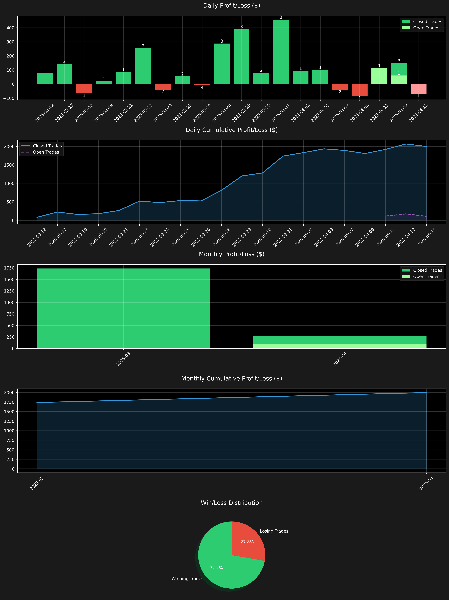
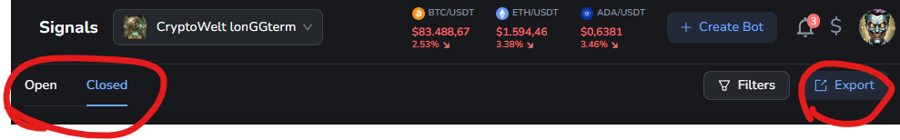

# Cornix Trading Signal Analysis Tool

A Python-based tool for analyzing trading signals from Cornix trading bot channels, generating statistical reports and visualizations of trading performance.



## Features

- **Channel Selection**: Easily select from available trading signal channels
- **Performance Analysis**: Calculate key metrics including win rate, profit factor, and average profit/loss
- **Visual Charts**: Generate daily and monthly profit/loss charts, cumulative profit tracking, and win/loss distribution
- **Detailed PDF Reports**: Create comprehensive PDF reports with statistics and trade history
- **Dark Mode UI**: Modern dark-themed interface for better visualization

## Signal Sources

This script was developed to analyze and generate statistics from CSV export files provided by Cornix trading signals. It works with data from the following private Telegram channels:

- [CryptoWelt siGGnals](https://t.me/+I1z8RUV3UatkMTIy) - Short-term trading signals
- [CryptoWelt lonGGterm](https://t.me/+NdKOrxolUMRmODg6) - Long-term trading signals

## Installation

### Prerequisites

- Python 3.6 or higher
  - Windows: Download and install from [python.org](https://www.python.org/downloads/windows/)
  - Ubuntu: Install using package manager:
    ```bash
    sudo apt update
    sudo apt install python3 python3-pip
    ```
- Required Python packages:
  - pandas
  - matplotlib
  - reportlab
  - numpy

### Setup

1. Clone this repository:
   ```
   git clone https://github.com/delta2win/cornix-trading-analysis.git
   cd cornix-trading-analysis
   ```

2. Install the required dependencies:
   ```
   pip install -r requirements.txt
   ```

## Usage

1. Organize your trading signal data in the following structure:
   - Each channel should have its own directory called "channelname"
   - Each channel directory should contain two CSV files:
     * channelname-open.csv (for open trades)
     * channelname-closed.csv (for closed trades)

2. Run the script:
   ```
   python cornix-stats.py
   ```

3. Select a channel from the displayed list when prompted

4. The script will generate:
   - A chart image in the 'output' directory
   - A detailed PDF report in the 'output' directory
   - The PDF will automatically open when complete

## CSV File Format

The CSV files should contain the following columns:
- Date: The date and time of the signal
- Symbol: The trading pair (e.g., BTC/USDT)
- Direction: Long or Short
- Entry Targets: Entry price
- Last Target: Exit price
- Signal Gained Profit %: The profit percentage

## Exporting Signals from Cornix

To export your trading signals from Cornix:

1. Log in to your Cornix dashboard
2. Navigate to the "Signals" section
3. Click the "Export" button in the top right corner
4. Select the date range for your export
5. Download both open and closed signals separately
6. Save the files as "channelname-open.csv" and "channelname-closed.csv" in a folder named "channelname"



## Example Output

The tool generates:
- Daily and monthly profit/loss charts
- Cumulative profit tracking
- Win/loss distribution
- Detailed PDF reports with statistics and trade history

## Contributing

Contributions are welcome! Please feel free to submit a Pull Request.

## License

```
Copyright 2025 delta2win

Licensed under the Apache License, Version 2.0 (the "License");
you may not use this file except in compliance with the License.
You may obtain a copy of the License at

    http://www.apache.org/licenses/LICENSE-2.0

Unless required by applicable law or agreed to in writing, software
distributed under the License is distributed on an "AS IS" BASIS,
WITHOUT WARRANTIES OR CONDITIONS OF ANY KIND, either express or implied.
See the License for the specific language governing permissions and
limitations under the License.
```

## Acknowledgments

- [Cornix Trading Bot](https://dashboard.cornix.io/register/23113CA1)
- [CryptoWelt Telegram Group](https://t.me/+9WWwDamOJsk2MGI0)
- [Private TradingView Strategy: CRYPTOWELT GG Standard V1.0](https://www.tradingview.com/script/2QEK8PSr-CRYPTOWELT-GG-Standard-V1-0/) 